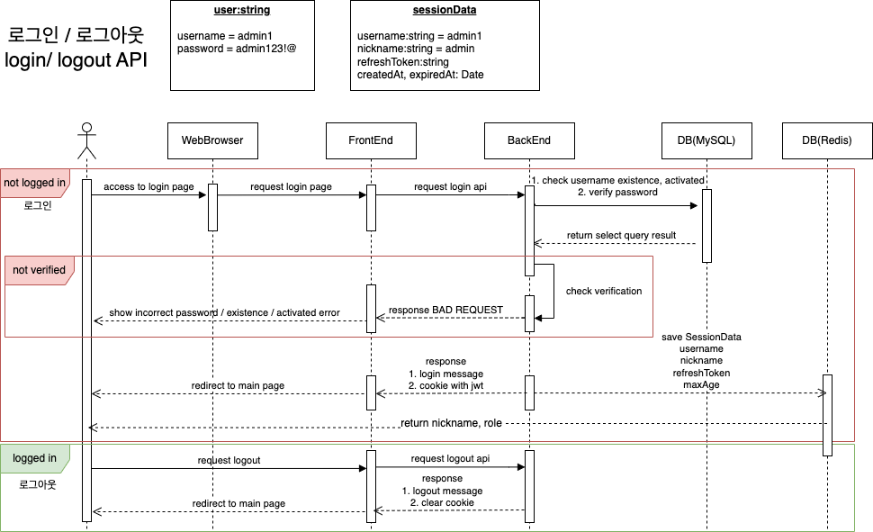

# [TwoFiveOne]

<div>

</div>

1. [**소개**](#소개)
2. [**개발 기간**](#개발-기간)
3. [**기술 스택**](#기술-스택)
4. [**주요 기능**](#주요-기능)
5. [**프로젝트 구성도**](#프로젝트-구성도)
6. [**실행 방법**](#실행-방법)

## 소개

> 악기연습에 도움을 주는 반주 백킹트랙 생성 서비스

원하는 코드, 리듬과 함께 반주 배경음악을 만들어 더 좋은 실력을 키워보세요!

## 개발 기간

### 2023.08.05 ~

## 기술 스택

### 💻 Front-end

Vue3

### 💻 Back-end

- Node.js, TypeScript, Express, Socket.io
- Mysql, Redis

<!-- ## ⭐ Infra Structure

<p align="center">
    
</p>

- AWS EC2 와 Docker 를 사용해 서버를 구축했어요.
- AWS S3 이미지 스토리지 서버를 사용하고 있어요.
 -->

<br />

## 주요 기능

<br />

- #### 백킹트랙 생성

<br />

- #### 백킹트랙 재생 및 저장

<br />

- #### 채팅기능 지원

<br />

- #### 만들어진 백킹트랙 게시판을 통한 공유

<br />

<!-- - #### 다크모드 지원 🌙 -->

<!-- <br /> -->

## 프로젝트 구성도 및 다이어그램

## Sequence Diagram



<br />

<br />

## 실행 방법

### client 실행

1. **원격 저장소 복제**

```bash
$ git clone https://github.com/sh5080/TwoFiveOne/
```

2. **프로젝트 폴더로 이동**

```bash
$ cd client
```

3. **필요한 node_modules 설치**

```bash
$ yarn install
```

4. **개발 서버 실행**

```bash
$ yarn start
```

<br />

### server 실행

1. **원격 저장소 복제**

```bash
$ git clone https://github.com/sh5080/TwoFiveOne/tree/backend
```

2. **프로젝트 폴더로 이동**

```bash
$ cd server
```

3. **main 메서드 실행하기**
